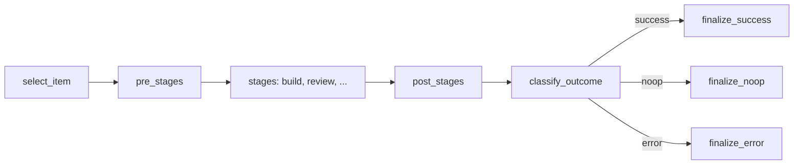

# Architecture

Cog is a **harness** for running Claude Code on tracked issues: the
control plane around `claude` subprocesses. Sandboxing (Docker), stage
orchestration, stream-json parsing, timeout / stall detection, state
management, telemetry, and a human hand-off surface (Textual TUI or
stderr in `--headless`). The refine → ralph workflow is one
configuration of that harness; the harness itself is workflow-agnostic.

Cog does not call the Anthropic API directly — it invokes the `claude`
CLI via `ClaudeCliRunner` with `--output-format stream-json` and parses
the event stream.

## Module layout

```
src/cog/
├── cli.py                  Typer entry point (cog, cog ralph, cog refine, cog doctor)
├── core/                   Abstract interfaces (no backend assumptions)
│   ├── workflow.py         Workflow, StageExecutor, ExecutionContext
│   ├── tracker.py          IssueTracker
│   ├── host.py             GitHost
│   ├── runner.py           AgentRunner + RunEvent types
│   ├── sandbox.py          Sandbox
│   ├── sinks.py            ItemPicker, ReviewProvider, RunEventSink, UserInputProvider
│   ├── item.py             Item + Comment
│   ├── outcomes.py         StageResult
│   ├── preflight.py        PreflightCheck + PreflightResult
│   ├── stage.py            Stage
│   └── errors.py           Harness exception hierarchy
├── workflows/              Concrete workflows (RalphWorkflow, RefineWorkflow)
├── runners/                AgentRunner backends (ClaudeCliRunner + DockerSandbox)
├── trackers/               IssueTracker backends (GitHubIssueTracker via `gh`)
├── hosts/                  GitHost backends (GitHubGitHost via `gh`)
├── ui/                     Textual TUI (shell, views, widgets, screens)
├── prompts/                Markdown prompt templates per stage
├── state.py                JsonFileStateCache (processed / deferred items)
├── state_paths.py          XDG-compliant state directory resolution
├── checks.py               Preflight checks + RALPH_CHECKS / REFINE_CHECKS
├── telemetry.py            TelemetryRecord + TelemetryWriter (runs.jsonl)
├── headless.py             Non-TUI event sink + iteration driver
├── loop.py                 Cross-iteration primitives
└── git.py                  Async git subprocess helpers
```

**Two separate abstractions — don't conflate**: `IssueTracker` (reads /
writes issues + comments + labels) and `GitHost` (branch / PR / CI
operations). Today both are GitHub-backed but the split is intentional
for future GitLab / Linear support. Keep tracker-agnostic code
tracker-agnostic in naming ("item" not "issue", "tracker" not "GitHub")
outside `trackers/` and `hosts/`.

## Seams

Each seam is a protocol or abstract class in `core/`; workflows depend
on the seam, backends implement it.

| Seam | Purpose | Current impl |
|------|---------|--------------|
| `AgentRunner` | Stream events from an agent subprocess | `ClaudeCliRunner` |
| `Sandbox` | Isolate the subprocess (exec in container) | `DockerSandbox`, `NullSandbox` |
| `IssueTracker` | Read / write items on a tracker | `GitHubIssueTracker` |
| `GitHost` | Push branches, open PRs, read CI status | `GitHubGitHost` |
| `ItemPicker` | Solicit item selection from the user | `TextualItemPicker`, in-view pickers |
| `ReviewProvider` | Solicit accept / edit / abandon for a rewrite | `ModalReviewProvider`, `RefineView` |
| `RunEventSink` | Consume `RunEvent`s during a stage | `LogPaneWidget`, `ChatPaneWidget`, `StderrEventSink` |
| `UserInputProvider` | Solicit a line of text (interactive workflows) | `ChatPaneWidget` |

## Iteration model



`StageExecutor` runs one workflow iteration through this shape. Loop
drivers (CLI headless, shell view) call `StageExecutor().run(workflow,
ctx)` per iteration with a fresh `ExecutionContext`.

**Don't replicate this shape inline** — extend the `Workflow` interface.

## Key invariants

- **Event-driven UI.** Stages run in a subprocess; events
  (`AssistantText`, `ToolUse`, `StageStart`/`End`, `ItemSelected`,
  `Status`) flow through `ctx.event_sink` to whichever widget is
  mounted. Adding a new UI signal means adding an event type in
  `core/runner.py` and a handler in the widget's `emit()`.
- **Ralph failures are additive, not destructive.** On error, ralph
  keeps `agent-ready`, adds `agent-failed`. `agent-failed` is a
  *signal*, not a terminal state — it clears on the next success.
- **Revival rule.** A processed item becomes eligible again when
  `item.updated_at > record.ts`. Users can re-queue an item by editing
  it on the tracker; no label manipulation required.
- **Deferred items aren't labels.** Ralph parses `blocked by #N` /
  `depends on #N` from body + comments; defers via `state.json` until
  blockers close. No tracker-visible state change.
- **`@me` filter is intentionally split.** Interactive picker-flow
  surfaces (ralph queue list, refine queue list, dashboard counts) show
  team-wide items so users can see shared work. The autonomous ralph
  selection loop (`RalphWorkflow.select_item`) and its state-recovery
  counterpart (`state.py:recover_from_remote`) keep `assignee="@me"` so
  ralph never auto-implements a teammate's item without explicit opt-in.
- **Refine runs only in Textual mode.** Requires an ItemPicker. Headless
  refine errors out by design (no way to do interactive chat without a
  UI).
- **`fresh_iteration_context` preserves `item` on iteration 1** when the
  caller pre-populated `base_ctx.item` (e.g. `--item N` or a main-menu
  picker). See `cog/loop.py`.

## TUI shell

The root screen is `CogShellScreen` — a persistent sidebar + content
layout. All views are mounted always; visibility toggles via `display`.
Workers owned by a view stay alive across view switches, so you can
start a ralph run, flip to refine mid-interview, and come back to ralph
with the log caught up.

```
┌──────────┬──────────────────────────────────────────────────┐
│ sidebar  │ active view (content area)                       │
│ ^1 Dash  │                                                  │
│ ^2 Ref●  │  <DashboardView / RefineView / RalphView / ChatView>
│ ^3 Ral   │                                                  │
│ ^4 Chat  │                                                  │
└──────────┴──────────────────────────────────────────────────┘
 ^Q Quit
```

- **Ctrl+1/2/3/4** — switch views
- **Ctrl+Q** — quit (confirm if workflows in-flight)
- Sidebar yellow `●` — attention indicator (refine awaiting reply, run
  complete, etc.)
- Each view exposes `focus_content()` and `busy_description()` hooks
  the shell uses

## State directory

Per-project state under `$XDG_STATE_HOME/cog/<project-slug>/` (default:
`~/.local/state/cog/<project-slug>/`). `<project-slug>` is the project
directory name with non-alphanumerics replaced by `-`.

| Path | Contents |
|------|----------|
| `state.json` | Processed / deferred item tracking. Processed entries are revived if the issue is edited after the record (`updated_at > ts`). |
| `runs.jsonl` | One JSON line per workflow run — telemetry record. Append-only with fcntl locking. |
| `reports/<ts>-<workflow>-<item-slug>.md` | Human-readable run report. Refine reports include the original body, proposed body, full interview transcript, and per-stage cost table. |

## Telemetry (runs.jsonl)

Each run appends one JSON line. Key fields:

| Field | Description |
|-------|-------------|
| `ts` | ISO-8601 UTC timestamp |
| `workflow` | `ralph` or `refine` |
| `item` | Issue number |
| `outcome` | `success` / `no-op` / `error` / `push-failed` / `rebase-conflict` / `ci-failed` / `deferred-by-blocker` |
| `branch`, `pr_url` | If applicable |
| `duration_seconds`, `total_cost_usd` | Wall time and summed cost |
| `stages[]` | Per-stage: `stage`, `model`, `duration_s`, `cost_usd`, `exit_status`, `commits`, `input_tokens`, `output_tokens` |
| `error`, `cause_class` | Formatted error + exception class on failure |
| `resumed` | `true` if the iteration resumed an existing branch |
| `retry_count`, `ci_failed_checks` | Fix-on-CI metadata |

`cause_class` lets you filter retry-eligible failures (runner stalls /
timeouts) from logic errors when querying telemetry.

## Preflight

Every workflow run starts with a preflight check bundle. Defined in
[`src/cog/checks.py`](../src/cog/checks.py).

| Check | Scope | Verifies |
|-------|-------|----------|
| `host_tool.git` | both | `git` on PATH |
| `host_tool.gh` | both | `gh` on PATH |
| `host_tool.docker` | both | `docker` on PATH |
| `git_repo` | both | Inside a git worktree |
| `clean_tree` | ralph | No staged / unstaged / untracked changes |
| `origin_remote` | both | `origin` remote configured |
| `gh_auth` | both | `gh auth status` passes |
| `gh_token_file` | both | gh token is file-based (not macOS keychain) |
| `docker_running` | both | Docker daemon reachable |
| `claude_auth` | both | `ANTHROPIC_API_KEY` or keychain entry present (warning) |

Run `cog doctor` to check without launching a workflow.

## Environment variables

| Variable | Default | Purpose |
|----------|---------|---------|
| `COG_REFINE_INTERVIEW_MODEL` | `claude-opus-4-7` | Refine interview turns |
| `COG_REFINE_REWRITE_MODEL` | `claude-opus-4-7` | Refine rewrite stage |
| `COG_RALPH_BUILD_MODEL` | `claude-sonnet-4-6` | Ralph build stage |
| `COG_RALPH_REVIEW_MODEL` | `claude-opus-4-7` | Ralph review stage |
| `COG_RALPH_DOCUMENT_MODEL` | `claude-sonnet-4-6` | Ralph document stage |
| `COG_CHAT_MODEL` | `claude-opus-4-7` | Chat view (Ctrl+4) |
| `COG_RUNNER_TIMEOUT_SECONDS` | `1800` | Overall subprocess wall-clock limit |
| `COG_RUNNER_INACTIVITY_TIMEOUT_SECONDS` | `300` | Idle window with no stream events |
| `COG_RUNNER_TOOL_CALL_TIMEOUT_SECONDS` | `600` | Per-tool-call limit |
| `COG_STREAM_LINE_LIMIT_BYTES` | `16777216` (16 MiB) | Max bytes per streamed JSON line |
| `COG_CI_POLL_INTERVAL_SECONDS` | `15` | Interval between `gh pr checks` polls |
| `COG_CI_TIMEOUT_SECONDS` | `1800` | Total CI wait before timing out |
| `COG_CI_MAX_RETRIES` | `2` | Max fix-on-CI-failure retries |
| `XDG_STATE_HOME` | `~/.local/state` | Base directory for state files |
| `EDITOR` | unset | Editor for `e` binding in review (falls back to `nano`, then `vi`) |
| `ANTHROPIC_API_KEY` | unset | Required if not using macOS keychain |

## Extending

### New tracker backend

1. Implement `IssueTracker` (`src/cog/core/tracker.py`).
2. Put the impl in `src/cog/trackers/<name>.py`.
3. Wire it up in `cog/ui/wire.py` based on repo config / env.

Use `GitHubIssueTracker` as a reference. Its subprocess interactions
go through `FakeSubprocessRegistry` in tests — any new tracker should
follow the same pattern so its tests stay hermetic.

### New git host backend

Same pattern as a tracker: implement `GitHost`, drop in `src/cog/hosts/`,
wire in factories. `GitHubGitHost` is the reference.

### New runner backend

Implement `AgentRunner.stream()`. Must yield `RunEvent` instances and
end with a `ResultEvent`. See `ClaudeCliRunner` for the reference.

### New workflow

1. Subclass `Workflow` (`src/cog/core/workflow.py`).
2. Implement `select_item` / `stages` / `classify_outcome` at minimum.
3. Register in `src/cog/workflows/__init__.py::WORKFLOWS`.
4. For a TUI presence, create a view widget under `src/cog/ui/views/`
   and add it to `CogShellScreen`'s compose.
