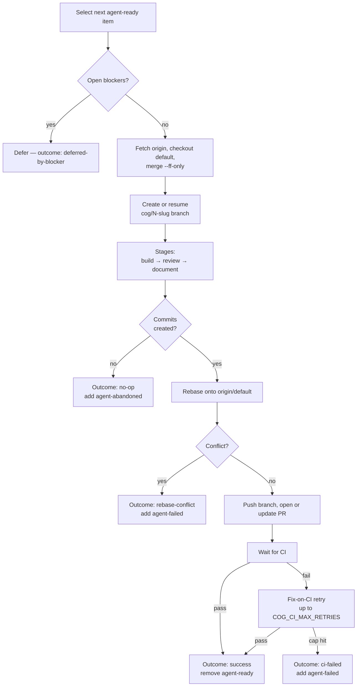

# Ralph workflow

Autonomous agent. Queue label: `agent-ready`. Supports `--headless` for
CI-style runs.

Ralph picks an agent-ready issue, builds → reviews → documents the change
inside a Docker sandbox, pushes the branch, opens a PR, waits for CI, and
hands off (or retries fixes) based on the result.

## Iteration flow



## Stages

| Stage | Default model | Purpose |
|-------|---------------|---------|
| `build` | `claude-sonnet-4-6` | Implement the change + write tests |
| `review` | `claude-opus-4-7` | Review build output; fix issues found |
| `document` | `claude-sonnet-4-6` | Update docs / comments. Failures don't abort the iteration — they're reported in the PR body |

Override each via `COG_RALPH_BUILD_MODEL` / `COG_RALPH_REVIEW_MODEL` /
`COG_RALPH_DOCUMENT_MODEL`.

Prompts live in [`src/cog/prompts/claude/ralph/`](../../src/cog/prompts/claude/ralph/)
as markdown. Change prompt behavior by editing the markdown, not Python.

## Outcomes

| Outcome | Trigger | Effect |
|---------|---------|--------|
| `success` | PR opened (or updated) and CI passed | Remove `agent-ready` |
| `no-op` | Claude exited without committing | Add `agent-abandoned`, remove `agent-ready` |
| `error` | Stage raised an unhandled exception | Add `agent-failed`, keep `agent-ready` (eligible for resume) |
| `push-failed` | Could not push the branch | Add `agent-failed` |
| `rebase-conflict` | Claude couldn't resolve rebase conflicts | Add `agent-failed` |
| `ci-failed` | CI failed and fix-on-CI retries exhausted | Add `agent-failed`, remove `agent-ready` |
| `deferred-by-blocker` | Item has open blocker issues | Skip this iteration; item re-evaluated next iteration |

## Label lifecycle

Additive, not destructive:

- `agent-ready` — queue label. Removed on `success`, `no-op`, `ci-failed`.
  Kept on `error` so the item stays eligible for resume next run.
- `agent-failed` — signals failure. Added on any failure path.
  **Removed** when a subsequent run succeeds.
- `agent-abandoned` — added on `no-op`.

`blocked by #N` and `depends on #N` in issue body or comments are parsed
by ralph for blocker tracking — no label involved.

## Fix-on-CI retry

If CI fails, ralph runs a fix-on-CI loop:

1. Reproduce the failure locally
2. Invoke a fix stage to address it
3. Push the fix
4. Wait for CI again

Capped at `COG_CI_MAX_RETRIES` (default: 2). If all retries fail or CI
times out, the outcome is `ci-failed` and the item gets `agent-failed`.

## Branch resume

If ralph is interrupted (cancelled, error) while on `cog/N-<slug>`, the
next run on that same item can resume the branch rather than recreating
it. Ralph detects an existing branch with unpushed commits and resumes
from there; otherwise it restarts from a fresh default branch. Pass
`--restart` to force recreation.

## Commands

```bash
# Queue-drain (headless)
cog ralph --loop --headless

# Specific item, once, in the TUI
cog ralph --item 42

# Specific item, headless (useful for CI or background runs)
cog ralph --item 42 --headless

# Force recreate an existing branch
cog ralph --item 42 --restart
```

## In the TUI

Within the shell, **Ctrl+3** opens the Ralph view:

- Idle: queue list showing all `agent-ready` items (team-wide, not
  filtered to `@me`). Each row shows the item title, an assignee suffix
  `(@login)` when assigned, and a history badge (prior run count +
  outcome + total cost from `runs.jsonl`). The autonomous run loop
  still only picks items assigned to you — the broader queue list is
  for visibility, not auto-selection.
- Running: live log pane + footer showing cost and elapsed time.
- Post-run: completion / failure panel with per-stage cost breakdown.

Workers persist across view switches — flip to refine (Ctrl+2) or the
dashboard (Ctrl+1) mid-run and the log keeps streaming in the
background. A yellow `●` appears on the Ralph sidebar row when the run
finishes (attention indicator).

## Related

- [Architecture](../ARCHITECTURE.md) — harness internals and seams
- [Refine workflow](./refine.md) — the sibling interactive workflow
