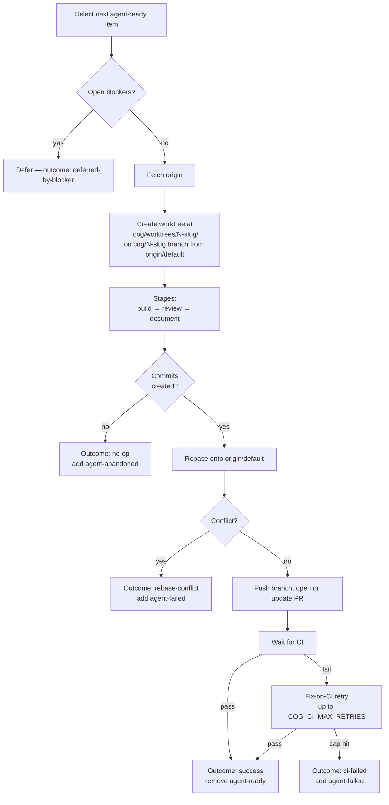

# Ralph workflow

Autonomous agent. Queue label: `agent-ready`. Supports `--headless` for
CI-style runs.

Ralph picks an agent-ready issue, builds → reviews → documents the change
inside a Docker sandbox, pushes the branch, opens a PR, waits for CI, and
hands off (or retries fixes) based on the result.

## Iteration flow



## Stages

| Stage | Default model | Purpose |
|-------|---------------|---------|
| `build` | `claude-sonnet-4-6` | Implement the change + write tests |
| `review` | `claude-opus-4-7` | Review build output; fix issues found |
| `document` | `claude-sonnet-4-6` | Update docs / comments. Failures don't abort the iteration — they're flagged in the PR body |

Override each via `COG_RALPH_BUILD_MODEL` / `COG_RALPH_REVIEW_MODEL` /
`COG_RALPH_DOCUMENT_MODEL`.

Prompts live in [`src/cog/prompts/claude/ralph/`](../../src/cog/prompts/claude/ralph/)
as markdown. Change prompt behavior by editing the markdown, not Python.

### Stewardship

<!-- Stewardship criteria (Small / Adjacent / Same-shape) appear in three
     places. Keep the criteria definitions consistent across:
       - src/cog/prompts/claude/ralph/build.md
       - src/cog/prompts/claude/ralph/review.md
       - docs/workflows/ralph.md (this file)
     The surrounding framing differs per context (build prompt = "do this",
     review prompt = "don't flag these", these docs = "the system does this");
     only the three criteria themselves must stay in sync. -->

The build stage is expected to fold small adjacent improvements into the same
PR rather than leave them behind. A noticed fix belongs in the PR only when all
three of the following hold; otherwise it goes under `### Follow-up items`:

- **Small** — roughly one function or a handful of lines; must not grow the
  diff by more than ~30% or pull in a new module.
- **Adjacent** — the file or area is already open as part of the primary work.
- **Same-shape** — a bug fix, a missing test, or a local refactor.
  Abstraction redesigns or public interface changes are not same-shape.

The review stage is briefed on these criteria and will not flag stewardship
folds as scope creep. Changes that cross into unrelated areas of the codebase
or that modify a public interface unrelated to the primary task are still
genuine scope concerns and will be flagged.

## PR body

Each main stage ends its final message with four structured sections that
ralph extracts into the PR body:

| Section | Source priority | Description |
|---------|-----------------|-------------|
| `## Summary` | document → review → build | 2–4 sentence description of what changed and why |
| `## Key changes` | document → review → build | Conceptual bullet list for the reviewer |
| `## Test plan` | document → review → build | Manual verification checklist |
| `## Follow-up items` | all stages, aggregated | Items noticed during THIS stage that don't fit the above |

**Source priority** means ralph uses the first non-empty value found,
checking document then review then build. Review and document stages
default to copying the build stage's sections forward verbatim unless
they have something to correct or add.

**Follow-up items** are cumulative: ralph collects each stage's
`### Follow-up items` block and appends them all under one
`## Follow-up items` section in the PR body. Each stage only lists items
it noticed — do not copy items from earlier stages or they will be
duplicated.

## Outcomes

| Outcome | Trigger | Effect |
|---------|---------|--------|
| `success` | PR opened (or updated) and CI passed | Remove `agent-ready` |
| `no-op` | Claude exited without committing | Add `agent-abandoned`, remove `agent-ready` |
| `error` | Stage raised an unhandled exception | Add `agent-failed`, keep `agent-ready` (eligible for resume) |
| `push-failed` | Could not push the branch | Add `agent-failed` |
| `rebase-conflict` | Claude couldn't resolve rebase conflicts | Add `agent-failed` |
| `ci-failed` | CI failed and fix-on-CI retries exhausted | Add `agent-failed`, remove `agent-ready` |
| `deferred-by-blocker` | Item has open blocker issues | Skip this iteration; item re-evaluated next iteration |

## Label lifecycle

Additive, not destructive:

- `agent-ready` — queue label. Removed on `success`, `no-op`, `ci-failed`.
  Kept on `error` so the item stays eligible for resume next run.
- `agent-failed` — signals failure. Added on any failure path.
  **Removed** when a subsequent run succeeds.
- `agent-abandoned` — added on `no-op`.

`blocked by #N` and `depends on #N` in issue body or comments are parsed
by ralph for blocker tracking — no label involved.

## Fix-on-CI retry

If CI fails, ralph runs a fix-on-CI loop:

1. Reproduce the failure locally
2. Invoke a fix stage to address it
3. Push the fix
4. Wait for CI again

Capped at `COG_CI_MAX_RETRIES` (default: 2). If all retries fail or CI
times out, the outcome is `ci-failed` and the item gets `agent-failed`.

## Worktrees

Each iteration runs in an isolated git worktree under
`.cog/worktrees/<id>-<slug>/` rather than the main checkout. This means
ralph's file writes never touch your working tree.

Worktree lifecycle:

- **Created** at `iteration_start` via `git worktree add`. The main
  checkout is never modified.
- **Removed** at `iteration_end` once the branch is pushed (or is
  already up-to-date with origin).
- **Left in place** if the iteration ends with a dirty tree — the item
  gets `agent-failed` and is skipped until the worktree is resolved
  manually (or removed with `git worktree remove --force`).

At startup ralph runs an orphan scan over `.cog/worktrees/` to recover
worktrees from crashed runs: clean ones are pushed (if ahead) and
removed; dirty ones surface as `agent-failed` comments on the item.

## Branch resume

If ralph is interrupted while on `cog/N-<slug>`, the next run resumes
the existing branch in a fresh worktree rather than recreating it from
scratch. Ralph detects an existing local or remote branch with commits
and resumes from there. Pass `--restart` to force recreation from the
default branch.

## Commands

```bash
# Queue-drain (headless)
cog ralph --loop --headless

# Specific item, once, in the TUI
cog ralph --item 42

# Specific item, headless (useful for CI or background runs)
cog ralph --item 42 --headless

# Force recreate an existing branch
cog ralph --item 42 --restart
```

## In the TUI

Within the shell, **Ctrl+3** opens the Ralph view:

- Idle: queue list showing all `agent-ready` items (team-wide, not
  filtered to `@me`). Each row shows the item title, an assignee suffix
  `(@login)` when assigned, and a history badge (prior run count +
  outcome + total cost from `runs.jsonl`). The autonomous run loop
  still only picks items assigned to you — the broader queue list is
  for visibility, not auto-selection.
- Running: live log pane + footer showing cost and elapsed time.
- Post-run: completion / failure panel with per-stage cost breakdown.

Workers persist across view switches — flip to refine (Ctrl+2) or the
dashboard (Ctrl+1) mid-run and the log keeps streaming in the
background. A yellow `●` appears on the Ralph sidebar row when the run
finishes (attention indicator).

## Iteration reports

After each iteration ralph writes a markdown report to
`$XDG_STATE_HOME/cog/<project-slug>/reports/<ts>-ralph-<slug>.md`
(default: `~/.local/state/cog/<project-slug>/reports/`).

Report sections (in order):

| Section | Content |
|---------|---------|
| `## Item` | Item number, title, and URL |
| `## Stages` | Per-stage cost, token counts, and duration |
| `## Iteration commentary` | All text Claude emitted during stage execution, grouped by stage. Headings inside the commentary are demoted one level. Omitted if Claude produced no text output. |
| `## Outcome` | Final outcome label and any error message |

The commentary section is useful when running headless (`--headless`) — it
lets you recover what Claude said about its decisions without having watched
the live TUI pane.

## Related

- [Architecture](../ARCHITECTURE.md) — harness internals and seams
- [Refine workflow](./refine.md) — the sibling interactive workflow
