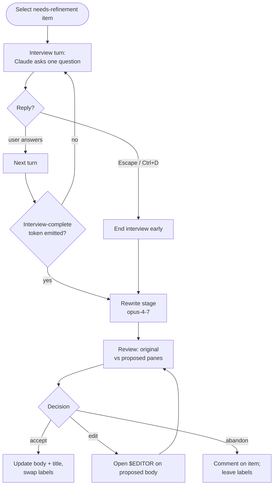

# Refine workflow

Interactive refinement. Queue label: `needs-refinement`. TUI only (no
`--headless`).

Refine walks the decision tree on an unclear issue through a multi-turn
interview, then rewrites the body into an implementation specification
detailed enough that a headless ralph run can ship the change without
asking clarifying questions.

## Iteration flow



## Phases

### 1. Interview

Multi-turn chat with Claude in a `ChatPaneWidget`. Claude asks one
question at a time, always with a recommended answer; you agree, push
back, or pick an alternative. Walks the decision tree top-down
(architecture → behavior → error paths → scope → failure modes →
testing) until every branch has a concrete answer.

Uses `COG_REFINE_INTERVIEW_MODEL` (default: `claude-opus-4-7`).

### 2. Rewrite

Non-interactive Claude call that crystallizes the interview decisions
into an implementation specification (updated title + body). Output
format is `### Title` + `### Body` sections.

Uses `COG_REFINE_REWRITE_MODEL` (default: `claude-opus-4-7`).

### 3. Review

Original and proposed bodies shown side-by-side in the split pane. The
chat pane is hidden (but preserved — scrollback survives) while the
proposed body occupies the right side. You accept, edit, or abandon.

## Keybindings

### Interview (chat pane)

| Key | Action |
|-----|--------|
| `Enter` | Submit reply (empty is a valid reply) |
| `Shift+Enter` | Insert newline |
| `Escape` / `Ctrl+D` | End interview early |
| `Ctrl+C` | Cancel the whole workflow |

### Split pane (running and review)

| Key | Action |
|-----|--------|
| `Ctrl+,` | Narrow the issue pane (min 20%) |
| `Ctrl+.` | Widen the issue pane (max 80%) |

### Review

| Key | Action |
|-----|--------|
| `a` | Accept — apply body + title, swap `needs-refinement` → `agent-ready` |
| `e` | Open `$EDITOR` on the proposed body; resume on exit |
| `Shift+Q` | Abandon — no body change, `needs-refinement` stays |

Pressing `e` drops into `$EDITOR` (falls back to `nano`, then `vi`).
Exiting without saving returns to the review prompt — **not** abandon.

## Outcomes

- **Accept** — body + title updated on tracker; `needs-refinement`
  removed, `agent-ready` applied. If the interview ended early,
  `partially-refined` is also applied and the body gains a ⚠ warning.
- **Abandon** — no label changes. A comment is posted on the item
  explaining the rewrite was not applied. Re-run `cog refine --item N`
  to retry.

## Reports

After each iteration (accept or abandon) a markdown report is written
to `~/.local/state/cog/<slug>/reports/<ts>-refine-<item-slug>.md`. It
contains the full original body, the proposed/applied body, the complete
interview transcript, and a per-stage cost table.

## Commands

```bash
# Pick from the needs-refinement queue (interactive)
cog refine

# Specific item
cog refine --item 42
```

Without `--item`, the CLI path loops through the queue until you cancel
the picker.

## In the TUI

Within the shell, **Ctrl+2** opens the Refine view:

- Idle: queue list showing all `needs-refinement` items (team-wide,
  not filtered to `@me`). Each row shows the item title and an
  assignee suffix `(@login)` when assigned. Enter to start.
- Running: split pane — issue body + comments (left) / chat (right).
  Resize with `Ctrl+,` / `Ctrl+.`. Panes stack vertically on narrow
  terminals (< 100 columns).
- Review: left pane keeps the original body; right pane switches to the
  proposed body. A title strip above shows old → new title.
  `a / e / Shift+Q` as above.

Worker persists across view switches — flip to Ralph (Ctrl+3) or the
dashboard (Ctrl+1) mid-interview and the chat scrollback + pending
reply state survive.

A yellow `●` appears on the Refine sidebar row when the chat is awaiting
your reply or the review is ready (attention indicator).

## Related

- [Architecture](../ARCHITECTURE.md) — harness internals, `ReviewProvider` seam
- [Ralph workflow](./ralph.md) — downstream consumer of refined items
